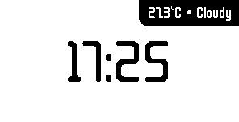
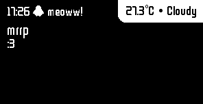
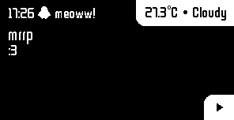
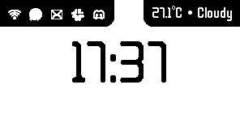

<font color=pink><h1><marquee>:3&nbsp;:3&nbsp;:3&nbsp;:3&nbsp;:3&nbsp;:3&nbsp;:3&nbsp;:3&nbsp;:3&nbsp;:3&nbsp;:3&nbsp;:3&nbsp;:3&nbsp;:3&nbsp;:3&nbsp;:3&nbsp;:3&nbsp;:3&nbsp;:3&nbsp;:3&nbsp;:3&nbsp;:3&nbsp;:3&nbsp;:3&nbsp;:3&nbsp;:3&nbsp;:3&nbsp;:3&nbsp;:3&nbsp;:3&nbsp;:3&nbsp;:3&nbsp;:3&nbsp;:3&nbsp;:3&nbsp;:3&nbsp;:3&nbsp;:3&nbsp;:3&nbsp;:3&nbsp;:3&nbsp;:3&nbsp;:3&nbsp;:3&nbsp;:3&nbsp;:3&nbsp;:3&nbsp;:3&nbsp;:3&nbsp;:3&nbsp;:3&nbsp;:3&nbsp;:3&nbsp;:3&nbsp;:3&nbsp;:3&nbsp;:3&nbsp;:3&nbsp;:3&nbsp;:3&nbsp;:3&nbsp;:3&nbsp;:3&nbsp;:3&nbsp;:3&nbsp;:3&nbsp;:3&nbsp;:3&nbsp;:3&nbsp;:3&nbsp;:3&nbsp;:3&nbsp;:3&nbsp;:3&nbsp;:3&nbsp;:3&nbsp;:3&nbsp;:3&nbsp;:3&nbsp;:3&nbsp;:3&nbsp;:3&nbsp;:3&nbsp;:3&nbsp;:3&nbsp;:3&nbsp;:3&nbsp;:3&nbsp;:3&nbsp;:3&nbsp;:3&nbsp;</marquee></h1></font>
# badgeydisp
Turn your Horizons Crux Badge into a desk clock & notifications display!

## Previews
| Clock only | Clock w/ Music |
|------------|----------------|
|  |  |

| Notification only | Notification w/ Music |
|------------|----------------|
|  |  |

| Clock w/ statusbar of past 5 notification icons |
|-------------------------------------------------|
| 

# Runtime requirements
- `playerctl` - for music (Not required, only if you want music to show up)
- `ca-certificates` - can you connect to the internet? not without these but worth noting if youre running this with some minimal system
- `gsettings-desktop-schemas` - detects preffered icon theme, falls back to `hicolor`
- `libcairo2` - for notification icons
- `gir1.2-glib2.0` - some glib data file thingies
- A dbus session, you probably have this if your shell shows notifications and / or media player state (for all players not just a specific one)
- `feh` or another image viewer with autoreload function - if you want to preview it without the hardware


# Other things
- Your user should be in the `dialout` group / you should have permissions for `/dev/ttyACM0`! (`sudo usermod -aG dialout $USER` and then log back out, and back in)

# Running
## With badge:
In any order:
- Plug badge in 
- Run the software

## Without badge:
- Run software
- Open an auto reloading image viewer
    I use `feh` personally, configured like so: `feh --reload 1 /tmp/badgey_preview`

## Running without binary
1. git clone this repo
2. install dis
```bash
sudo apt install python3-dev libdbus-1-dev libdbus-glib-1-dev libgirepository1.0-dev libcairo2-dev pkg-config libgirepository-2.0-dev -y
pip install -r requirements.txt --break-system-packages
```
3. `python3 .`

thats probably it

## Building
- `bash build.sh`


## AI Usage:
- debugging
- pyinstaller config
- checking shit like what things are needed at runtime
yuh


## Attribution
icons from google material symbols


<font color=pink><h1><marquee>:3&nbsp;:3&nbsp;:3&nbsp;:3&nbsp;:3&nbsp;:3&nbsp;:3&nbsp;:3&nbsp;:3&nbsp;:3&nbsp;:3&nbsp;:3&nbsp;:3&nbsp;:3&nbsp;:3&nbsp;:3&nbsp;:3&nbsp;:3&nbsp;:3&nbsp;:3&nbsp;:3&nbsp;:3&nbsp;:3&nbsp;:3&nbsp;:3&nbsp;:3&nbsp;:3&nbsp;:3&nbsp;:3&nbsp;:3&nbsp;:3&nbsp;:3&nbsp;:3&nbsp;:3&nbsp;:3&nbsp;:3&nbsp;:3&nbsp;:3&nbsp;:3&nbsp;:3&nbsp;:3&nbsp;:3&nbsp;:3&nbsp;:3&nbsp;:3&nbsp;:3&nbsp;:3&nbsp;:3&nbsp;:3&nbsp;:3&nbsp;:3&nbsp;:3&nbsp;:3&nbsp;:3&nbsp;:3&nbsp;:3&nbsp;:3&nbsp;:3&nbsp;:3&nbsp;:3&nbsp;:3&nbsp;:3&nbsp;:3&nbsp;:3&nbsp;:3&nbsp;:3&nbsp;:3&nbsp;:3&nbsp;:3&nbsp;:3&nbsp;:3&nbsp;:3&nbsp;:3&nbsp;:3&nbsp;:3&nbsp;:3&nbsp;:3&nbsp;:3&nbsp;:3&nbsp;:3&nbsp;:3&nbsp;:3&nbsp;:3&nbsp;:3&nbsp;:3&nbsp;:3&nbsp;:3&nbsp;:3&nbsp;:3&nbsp;:3&nbsp;:3&nbsp;</marquee></h1></font>
